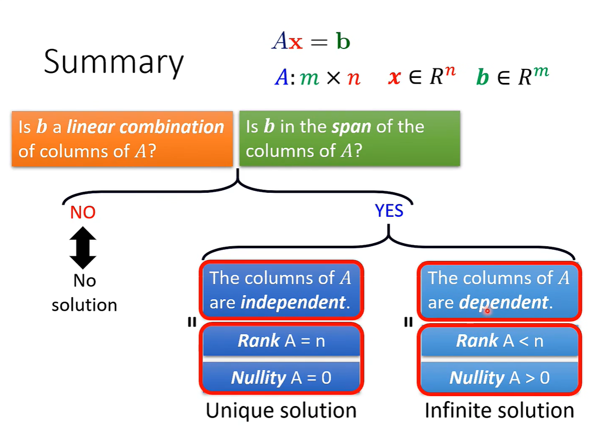
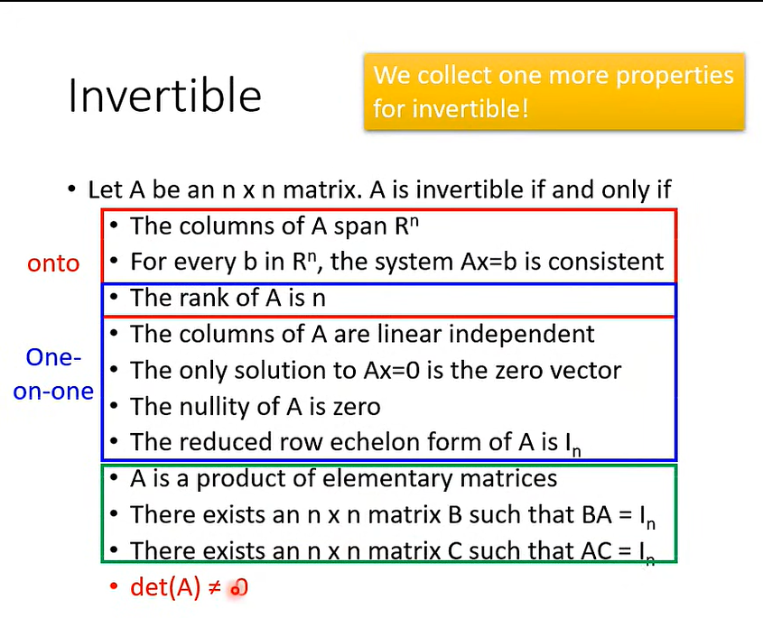

# 参考
- [线性代数的本质-3Blue1Brown中文配音](https://www.bilibili.com/video/BV1ib411t7YR?p=1)[ | 中文字幕](https://www.bilibili.com/video/BV1ys411472E)[ | 英文版](https://www.youtube.com/playlist?list=PLZHQObOWTQDPD3MizzM2xVFitgF8hE_ab)[ | 文字版](https://o1zys.github.io/2018/01/03/EssenceOfLinearAlgebra/)
- [麻省理工公开课：线性代数视频中文字幕](https://open.163.com/newview/movie/courseintro?newurl=%2Fspecial%2Fopencourse%2Fdaishu.html)[ | 英文原版视频](https://ocw.mit.edu/courses/mathematics/18-06-linear-algebra-spring-2010/)[ | A 2020 Vision of Linear Algebra](https://ocw.mit.edu/resources/res-18-010-a-2020-vision-of-linear-algebra-spring-2020/index.htm)[ | 18.06 Linear Algebra, Spring 2020](https://mitmath.github.io/1806/)
- [【线性代数 上】清华大学 马辉 徐帆](https://www.bilibili.com/video/BV11z4y1f7ym/) [| 【线性代数 下】清华大学 马辉 徐帆](https://www.bilibili.com/video/BV14k4y1y7uR/)
- [可汗线性代数](https://www.khanacademy.org/math/linear-algebra)
- [线性代数2022 李宏毅](https://www.bilibili.com/video/BV16q4y1e7Cm?p=2)
- [mit-18.06-linalg-notes,python](https://github.com/apachecn/mit-18.06-linalg-notes)
- [Introduction to Linear Algebra for Applied Machine Learning with Python](https://pabloinsente.github.io/intro-linear-algebra)
- [Linear_Algebra_With_Python](https://github.com/MacroAnalyst/Linear_Algebra_With_Python)
- [MIT-18.06-线性代数-完整笔记 markdown版](https://github.com/guokaide/linear-algebra)
- [线性代数 python](https://github.com/meichaofan/linear-algebra)
- [《线性代数及其应用》笔记](https://github.com/huangtinglin/Linear-Algebra-and-Its-Applications-notes)
- [线性代数 中英文对照表](http://www.gaoshufudao.com/LinearAlgebra_Word.aspx)
# notes
- system：a system has input and output(function, transformation,operator)
- linear system: persevering multiplication + persevering addition
- 微积分运算都属于线性系统，电路学、微分方程、信号与系统也是线性系统
- 向量和向量集合（符合某些约束条件），Rn表示有n个元素的向量的集合
- 符合8特征的东西叫做向量
  + u+v=v+u
  + (u+v)+w=u+(v+w)
  + 0+u=u
  + u'+u=0
  + 1u=u
  + (ab)u=a(bu)
  + a(u+v)=au+av
  + (a+b)u=au+bu
- 线下系统=线下方程组，m个方程组，n个变量，m*n，线性方程组=矩阵*向量（行）=线性组合（列）
  + A(u+v)=Au+Av
  + A(cu)=c(Au)=(cA)u
  + (A+B)u=Au+Bu
  + A0=0
  + Ov=0
  + Iv=v
  + Au=Bu=>A=B
- 矩阵，向量也是矩阵[矩阵的运算及其运算规则](http://www2.edu-edu.com.cn/lesson_crs78/self/j_0022/soft/ch0605.html)
  + A+B=B+A
  + (A+B)+C=A+(B+C)
  + (st)A=s(tA)
  + s(A+B)=sA+sB
  + (s+t)A=sA+tA
  + (AB)C=A(BC)
  + A(B+C)=AB+AC
  + (B+C)A=BA+CA
  + (sA)B=s(AB)=A(sB)
  + (AT)T=A
  + (sA)T=sAT
  + (A+B)T=AT+BT
  + (AB)T=BTAT
  + (A-1)-1=A
  + (sA)-1=1/sA-1
  + (AB)-1=B-1A-1
  + (AT)-1=(A-1)T
  + |A-1|=1/|A|
  + AA\*=A\*A=|A|E
  + (A\*)-1=(A-1)\*
  + (kA)\*=kn-1A\*
  + (A\*)T=(AT)\*
  + |A*|=|A|n-1
  + (A\*)\*=|A|n-2A (n>=2)
- 方阵、上三角阵、下三角阵、对角阵、对称阵、单位阵、零阵、逆阵、转置阵、正交阵
- 向量的数乘、向量的内积、向量的外积、矩阵的数乘、矩阵的乘法、矩阵的哈达玛积、矩阵的克罗内克积
  - 矩阵的乘法(matrix product、matmul product,一般矩阵乘积,表示为m x p矩阵A与p x n矩阵B乘积结果 m x n )
  - 哈达玛积（Hadamard product，对形状相同的矩阵进行运算，表示为 A ⊙ B ）
  - 克罗内克积（Kronecker product，是两个任意大小矩阵间的运算，表示为 A ⊗ B ）
  - 内积（inner product）、点乘（dot product）、数量积（scalar product）、外积（outer product）、叉乘（cross product）、矢量积（vector product）
  - exterior product=cross product，属于解析几何中领域，两个向量法向量，右手法则
  - outer product，属于线代或张量
- AX=0 有非零解说明A的列向量集合是线性相关关(dependence)
- 矮胖型矩阵肯定是dependence
- rank=矩阵线性无关最多列数；nullity=总列数-rank
- [rref(reduced row echelon form,简化的行阶梯形矩阵)](https://ww2.mathworks.cn/help/matlab/ref/rref.html)

- Column Correspondence Theorem,矩阵和RREF结构一致性
- The three elementary row operations are: 
  - (Row Swap) Exchange any two rows. 
  - (Scalar Multiplication) Multiply any row by a constant. 
  - (Row Sum) Add a multiple of one row to another row.
- Gauss-Jordan 消去法(interchange、scaling(non zero)、row addition)
- 通过RREF求rank，求independence、求span
- basic variables、free variables、full rank、rank deficient、pivot column、nullity
- 通过逆矩阵解方程组x=A-1b
- 求逆矩阵[A I] => [R B], B=A-1

# 三个流行的开源数值线性代数库是：
- 线性代数包，或 LAPACK。
- 基本线性代数子程序，或 BLAS（线性代数库的标准）。
- 自动调谐线性代数软件，或 ATLAS。

